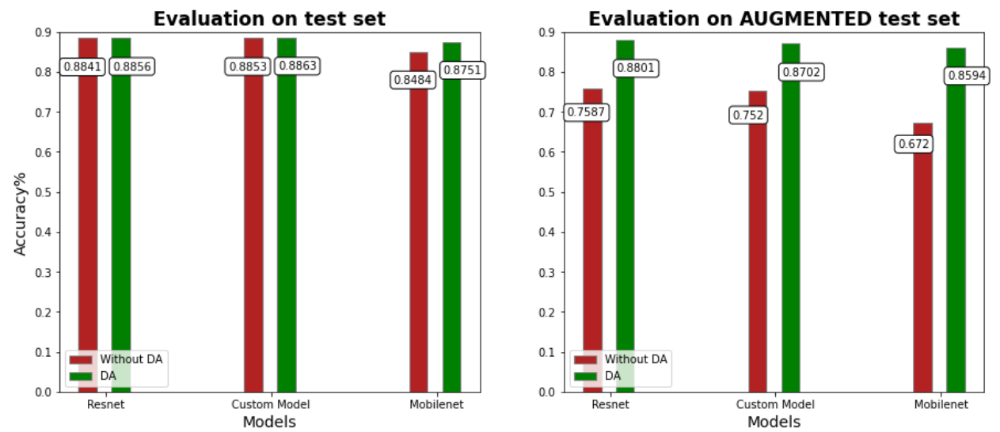

# csci7850-emnist
Handwritten English Character Recognition using Deep Learning Concepts 

## Specific Aim
The project aims to build a model for classifying handwritten English characters using EMNIST dataset. The dataset contains images that is low in dimensions (28x28). Although there are many popular image classifiers, solving images with such low dimensions might often be too computationally expensive. Thus, we have built a model step by step using keras tuner which results in equal accuracy compared to resnet50v2 and MobilenetV2 but with a 50% deduction in total parameters, and much fast. 

We have also examined the impact of data augmentation by training the models separately with and without data augmentation. We performed augmentation to the test set and assessed the accuracies in order to see the results. All of the models that were trained via data augmentation have been determined to be more reliable. The comparison is shown using a bar graph in the notebook (also at the end of the instructions).


## Instructions
The notebook also contains all the model blueprints, procedures to download the pre-trained model architectures and its weights.

To clone the repository and run the notebook please execute the below command.
```
git clone https://github.com/am2fq/csci7850-emnist.git
```
The notebook is divided in sections for ease of understanding as belows:
+ Data Preparation
+ View Data
+ Model Creation
+ Data Augmentation on test set
+ Downloading Pre-trained Models
+ Comparison among the models
+ Predictions

However, if you want to use the data-set or the models separately, you can either follow the snippets from the sections in notebook or below: 

###### 1. The dataset is available in below URL. You can download using tools like curl/wget.

Trainig images and labels
```
https://csci7850-emnist.nyc3.digitaloceanspaces.com/emnist-balanced-train-images-idx3-ubyte
https://csci7850-emnist.nyc3.digitaloceanspaces.com/emnist-balanced-train-labels-idx1-ubyte
```
Test images and labels
```
https://csci7850-emnist.nyc3.digitaloceanspaces.com/emnist-balanced-test-images-idx3-ubyte
https://csci7850-emnist.nyc3.digitaloceanspaces.com/emnist-balanced-test-labels-idx1-ubyte
```
Mapping file.
```
https://csci7850-emnist.nyc3.digitaloceanspaces.com/emnist-balanced-mapping.txt
```

*The complete process of downloading  and preparing the data-set is given in notebook under section 1 (Data Preparation)*
###### 2. Models

This project compares the custom built model with resnet50v2 and Mobilenetv2. All the blueprints of these 3 models are given in notebook under section 3 (Model Creation).
###### 3. Pre-trained Model.
To use the pre trained version of our custom built model, you will have to download the architecture and weights separately. Please follow the below instructions to do so.

Libraries
```
import tensorflow as tf
import tensorflow.keras as keras
import wget
```

a) Custom model Architecture.
```
mymodel_arch_URL = 'https://csci7850-emnist.nyc3.digitaloceanspaces.com/mymodel_wo_DA_arch.json'
mymodel_arch = wget.download(mymodel_arch_URL)
with open(mymodel_arch,"r") as json_file:
    Custom_model = keras.models.model_from_json(json_file.read())
Custom_model.compile(optimizer=keras.optimizers.Adam(learning_rate=0.00001),
loss=keras.losses.SparseCategoricalCrossentropy(),
metrics=[keras.metrics.SparseCategoricalAccuracy()])
```
Custom model weights
```
mymodel_DA_URL = 'https://csci7850-emnist.nyc3.digitaloceanspaces.com/mymodel_with_DA_weights.h5'
mymodel_DA_weights = wget.download(mymodel_DA_URL)
Custom_model.load_weights(mymodel_DA_weights)
```
b) Resnet Architecture.
```
res_arch_URL = 'https://csci7850-emnist.nyc3.digitaloceanspaces.com/resnet_wo_DA_arch.json'
resnet_arch = wget.download(res_arch_URL)
with open(resnet_arch,"r") as json_file:
    Resnet_model = keras.models.model_from_json(json_file.read())
Resnet_model.compile(optimizer=keras.optimizers.Adam(learning_rate=0.000025),
loss=keras.losses.SparseCategoricalCrossentropy(),
metrics=[keras.metrics.SparseCategoricalAccuracy()])
```
Resnet model weights
```
res_DA_URL = 'https://csci7850-emnist.nyc3.digitaloceanspaces.com/resnet_with_DA_weights.h5'
resnet_DA_weights = wget.download(res_DA_URL)
Resnet_model.load_weights(resnet_DA_weights)
```
c) MobilenetV2 Architecture.
*For mobilenetv2, the model was saved with weights. You don't have to download weights separately for this.*
```
Mobilenet_arch_URL = 'https://csci7850-emnist.nyc3.digitaloceanspaces.com/mobilenet_scratch_with_daug.h5'
Mobilenet_arch = wget.download(Mobilenet_arch_URL)
Mobilenet = keras.models.load_model(Mobilenet_arch)
Mobilenet.compile(optimizer=keras.optimizers.Adam(learning_rate=0.000025),
loss=keras.losses.SparseCategoricalCrossentropy(),
metrics=[keras.metrics.SparseCategoricalAccuracy()])
```
## Results.
The bar chart below depicts a comparison of the model accuracies when they were trained with and without data augmentation. Also, it can be seen that our custom model with a 50% deduction in parameters is giving nearly equal accuracy compared to resnet50v2 and mobilenetV2.


